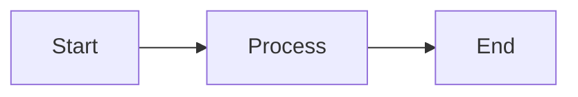

# CLAUDE.md

This file provides guidance to Claude Code (claude.ai/code) when working with code in this repository.

## Project Overview

HumblebeeAI Academy Curriculum is a Docusaurus-based educational website providing an open-source curriculum for transforming students into AI/Software engineers. The curriculum is divided into two main programs:

1. **School Program** (`docs/school/`): 6-month foundational program covering computational thinking, math, and basic engineering skills
2. **Soft Landing Program** (`docs/softlanding/`): Advanced program with core systems and specialization tracks

## Architecture

### Content Structure

- **`/docs`**: All curriculum content (Markdown/MDX files). This is the source of truth for educational content.
  - `docs/school/`: School program modules (computational thinking, calculus, probability, data engineering, IoT)
  - `docs/softlanding/core-systems/`: Core systems modules (math-ML, advanced AI, networking, fullstack ops)
  - `docs/softlanding/tracks/`: Specialization tracks (computer vision, data science, NLP, software engineering)
  - `docs/00-curriculum-outline.mdx`: Main curriculum roadmap
  - `docs/resources.mdx`: Learning resources
  - `docs/03-mentorship.mdx`: Mentorship guidelines

- **`/src`**: React/TypeScript frontend components
  - `src/pages/index.tsx`: Homepage with custom hero and features
  - `src/components/`: Reusable React components
  - `src/css/custom.css`: Global styles

- **`/blog`**: Blog posts (currently placeholder content)

- **`/static`**: Static assets (images, PDFs, etc.)

### Key Configuration Files

- `docusaurus.config.ts`: Main Docusaurus configuration
  - Site metadata (title, tagline, URL)
  - Theme settings (dark mode by default)
  - Navbar and footer configuration
  - Mermaid diagram support enabled
  - Edit URL points to GitHub repository

- `sidebars.ts`: Sidebar navigation (auto-generated from docs folder structure)

- `package.json`: Dependencies and build scripts

- `tsconfig.json`: TypeScript configuration (extends Docusaurus defaults)

### Documentation Format

All curriculum files use MDX format with frontmatter:
```yaml
---
sidebar_position: 1
title: Page Title
description: Page description
---
```

Documentation supports:
- Mermaid diagrams for flowcharts and visualizations
- Docusaurus admonitions (:::info, :::warning, etc.)
- Standard Markdown with React components

## Development Commands

### Setup
```bash
npm install
```

### Development Server
```bash
npm start
```
Starts local dev server at http://localhost:3000 with live reload.

### Build
```bash
npm run build
```
Creates production build in `build/` directory. Always test builds locally before deploying.

### Serve Production Build
```bash
npm run serve
```
Serves the production build locally for testing.

### Type Checking
```bash
npm run typecheck
```
Runs TypeScript compiler to check for type errors without emitting files.

### Clear Cache
```bash
npm run clear
```
Clears Docusaurus cache. Use when experiencing build issues or after updating dependencies.

## Working with Content

### Adding New Curriculum Pages

1. Create new `.mdx` file in appropriate directory (`docs/school/` or `docs/softlanding/`)
2. Add frontmatter with `sidebar_position`, `title`, and `description`
3. Sidebar will auto-generate based on file structure
4. Use category files (`_category_.yml`) to customize category labels and positions

### Editing Existing Content

- All curriculum content lives in `/docs` directory
- Homepage features are defined in `src/pages/index.tsx`
- Navigation links in `docusaurus.config.ts` under `navbar.items`

### Mermaid Diagrams

Mermaid support is enabled via `@docusaurus/theme-mermaid`. Use fenced code blocks:

````markdown

````

## Design System

### Home Page (`src/pages/index.tsx`)

The homepage uses a modern, animated design with:
- **Framer Motion**: Smooth scroll animations and transitions
- **Lucide React Icons**: Modern icon library for UI elements
- **3D Layered Cards**: Feature cards with shadow layers for depth effect
- **Apple-style Buttons**: Rounded buttons with hover animations

Components:
- `HomepageHeader`: Hero section with badge, gradient text, and CTA buttons
- `HomepageFeatures`: 3-column feature grid with animated cards
- `ProgramsSection`: Interactive program cards for School and Soft Landing
- `CTASection`: Final call-to-action with prominent button

### Navbar

Enhanced navbar with:
- Emoji icons for visual distinction (📚 Curriculum, 🎓 School, 🚀 Soft Landing)
- Direct links to School and Soft Landing programs
- GitHub icon integration
- Smooth hover effects and active states
- Mobile-responsive with improved sidebar

### Styling

Custom styles in `src/css/custom.css` and `src/pages/index.module.css`:
- CSS custom properties for theming
- Gradient text effects
- 3D card shadows with hover animations
- Backdrop blur effects
- Responsive breakpoints at 996px

## Important Notes

- **Node Version**: Requires Node.js >=20.0 (see `package.json` engines field)
- **Dark Mode**: Default theme is dark mode (`docusaurus.config.ts:62`)
- **Broken Links**: Configuration throws on broken internal links (`onBrokenLinks: 'throw'`)
- **Edit URLs**: Edit links point to GitHub main branch
- **Future Flag**: Docusaurus v4 compatibility flag enabled for smoother future upgrades
- **Dependencies**: Uses `framer-motion` and `lucide-react` for animations and icons
