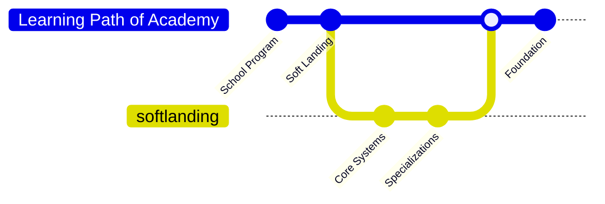

import Tabs from '@theme/Tabs';
import TabItem from '@theme/TabItem';
import { SkillShowcase, ResourceCard } from '@site/src/components';
import { motion } from 'framer-motion';
import { BookOpen, Code2, Building2, Clock, DollarSign, GraduationCap, FileText, Users, Sparkles, Rocket, Globe, Target, MapPin, Library, School, HelpCircle, Lightbulb, ArrowRight } from 'lucide-react';
import clsx from 'clsx';
import Heading from '@theme/Heading';
import problemCardStyles from '@site/src/components/ProblemCard.module.css';

# Your Journey to Becoming a Top 1% AI Engineer

  

    You want to become a production-ready AI engineer, but the path is rarely clear. This roadmap is the exact learning sequence we use at HumbleBee Academy. Follow it self-paced for free, or join the Academy to learn the same path with mentorship, reviews, and scenario-based projects running in parallel.
  

---

## <Globe /> Our Mission: Democratizing AI Education

Most aspiring AI engineers hit the same three barriers. We built HumbleBee Academy to remove them with a structured roadmap and an applied training environment.

  <motion.div
    className={clsx('col col--4')}
    initial={{ opacity: 0, y: 40 }}
    whileInView={{ opacity: 1, y: 0 }}
    viewport={{ once: true, margin: '-100px' }}
    transition={{ duration: 0.6, delay: 0 }}
  >
    

      

      

      

        

          <BookOpen size={32} strokeWidth={1.5} />
        

        <Heading as="h3" className={problemCardStyles.problemTitle}>The Theory-Practice Gap</Heading>
        
Concepts are taught, but production systems are not.

      

    

  </motion.div>
  <motion.div
    className={clsx('col col--4')}
    initial={{ opacity: 0, y: 40 }}
    whileInView={{ opacity: 1, y: 0 }}
    viewport={{ once: true, margin: '-100px' }}
    transition={{ duration: 0.6, delay: 0.15 }}
  >
    

      

      

      

        

          <Code2 size={32} strokeWidth={1.5} />
        

        <Heading as="h3" className={problemCardStyles.problemTitle}>Portfolio Paradox</Heading>
        
Hiring wants proof, but beginners lack real proof.

      

    

  </motion.div>
  <motion.div
    className={clsx('col col--4')}
    initial={{ opacity: 0, y: 40 }}
    whileInView={{ opacity: 1, y: 0 }}
    viewport={{ once: true, margin: '-100px' }}
    transition={{ duration: 0.6, delay: 0.3 }}
  >
    

      

      

      

        

          <Building2 size={32} strokeWidth={1.5} />
        

        <Heading as="h3" className={problemCardStyles.problemTitle}>Isolated Learning</Heading>
        
Without feedback, learning stalls and standards stay unclear.

      

    

  </motion.div>

**HumbleBee Academy was created to turn learning into real engineering output through mentorship, reviews, and scenario-based projects.**

:::tip Why This Curriculum is Open Source
We keep this roadmap open because a world-class learning path should not be locked behind geography or budget. The open curriculum is valuable on its own: it gives self-learners structure, sequence, and a clear standard for what "good" looks like.

The Academy builds on the same roadmap with what self-learning usually lacks: mentor feedback, code and design reviews, accountability, and internal scenario projects that force real-world application while you learn.
:::

---

## <Target /> What Makes This Path Different

Most programs optimize for completion. We optimize for capability.

The curriculum is the map. The Academy is the applied layer on top of the same map: mentorship, reviews, and scenario projects that simulate real work.

<table>
  <thead>
    <tr>
      <th>Feature</th>
      <th>Traditional Universities</th>
      <th>Online Bootcamps</th>
      <th>HumbleBee Academy Open Curriculum</th>
    </tr>
  </thead>
  <tbody>
    <tr>
      <td><strong><Clock size={16} /> Duration</strong></td>
      <td>4 years</td>
      <td>3-6 months</td>
      <td>Self-paced, but structured progression</td>
    </tr>
    <tr>
      <td><strong><DollarSign size={16} /> Cost</strong></td>
      <td>$100K+ in tuition debt</td>
      <td>$15-20K upfront payment</td>
      <td>Free curriculum (paid mentorship optional)</td>
    </tr>
    <tr>
      <td><strong><GraduationCap size={16} /> Credential</strong></td>
      <td>Degree with weak hiring signal</td>
      <td>Certificate with declining value</td>
      <td>Portfolio of production-grade projects</td>
    </tr>
    <tr>
      <td><strong><FileText size={16} /> Curriculum</strong></td>
      <td>Outdated curriculum (2-3 years behind industry)</td>
      <td>Simplified toy problems, not real engineering</td>
      <td>Live curriculum updated with industry standards</td>
    </tr>
    <tr>
      <td><strong><Users size={16} /> Learning</strong></td>
      <td>Theory-heavy courses</td>
      <td>Crash course</td>
      <td>Community-driven learning</td>
    </tr>
  </tbody>
</table>

---

## <MapPin /> Your Learning Path

This roadmap is progressive. Each phase builds foundations for the next. If you think you can skip ahead, use the placement test or phase checklist and only move forward if you can meet the bar.

## <Library /> Program Overview

School Program is the foundation. Core Systems and Specializations are part of Soft Landing.

Self-paced learners follow the roadmap directly. Academy learners follow the same roadmap while spending a major part of their time applying it in mentor-led scenario projects.

<Tabs>
<TabItem value="school" label="School Program" default>

### <School /> School Program
**Duration:** 2-4 months (self-paced)  
**Goal:** Build the fundamentals that make every later phase faster and less painful.

<SkillShowcase 
    skills={[
        { iconString: "Terminal", title: "Terminal Fluency", description: "The command line is your home." },
        { iconString: "GitBranch", title: "Git & Version Control", description: "Collaborate like a pro." },
        { iconString: "Sigma", title: "Math Foundations", description: "Calculus, Linear Algebra, Stats." },
        { iconString: "Database", title: "Data Engineering", description: "Python, Pandas, SQL." }
    ]} 
/>

**Outcome:** You can operate like an engineer: terminal, Git, data handling, and math basics strong enough to build without getting stuck.

In the Academy, you apply these fundamentals immediately through mentor-led tasks and reviews from week one.

[Start School Program →](/docs/school/intro)

</TabItem>

<TabItem value="soft-landing" label="Core Systems (Soft Landing)">

### <Rocket /> Core Systems
**Duration:** 3-6 months (self-paced)  
**Goal:** Master ML foundations and the engineering required to ship models reliably.

<SkillShowcase 
    skills={[
        { iconString: "BrainCircuit", title: "Deep Learning", description: "PyTorch, Neural Networks, CNNs." },
        { iconString: "Server", title: "Systems Ops", description: "Docker, FastAPI, Cloud Deploy." },
        { iconString: "Activity", title: "Model Eval", description: "Metrics, Testing, MLOps." }
    ]} 
/>

**Outcome:** You can build end-to-end ML systems: training, evaluation, deployment, and reliability basics using modern tools.

In the Academy, learners typically spend 35-70% on curriculum modules and the rest applying them inside scenario projects with mentor review.

[Start Soft Landing →](/docs/softlanding/intro)

</TabItem>

<TabItem value="specialization" label="Specializations (Soft Landing)">

### <Target /> Specialization Tracks
**Duration:** 2-4 months per track  
**Goal:** Expert-level domain knowledge

**Choose Your Path:**
- **Computer Vision:** classification, detection, real deployment patterns
- **Data Science:** modeling, experimentation, analytics for decisions
- **NLP and LLMs:** transformers, fine-tuning, agents, evaluation
- **Software Engineering:** scalability, distributed systems, reliability

**Outcome:** You produce domain-specific projects that show depth. Each track ends with a capstone that looks like real work: clear problem framing, measurable results, and a reproducible or deployable system.

[Explore Specializations →](/docs/softlanding/specializations/overview)

</TabItem>
</Tabs>

---

## <Lightbulb /> The HumbleBee Academy Learning Philosophy

### 1. **Learning by Doing**
We reject "tutorial-only" learning. The goal is to spend most of your time building. The Academy enforces this with scenario tasks and reviews so mistakes get corrected early.

### 2. **Longitudinal Growth**
Expertise compounds. We revisit core ideas across phases in increasingly realistic settings, not once and done.

### 3. **Community-Driven**
Learn with peers, get help, and contribute improvements. The roadmap stays alive because the community keeps raising the bar.

---

## <HelpCircle /> Frequently Asked Questions

What is the difference between the Open Curriculum and the Academy?

The Open Curriculum is the full roadmap and learning content, self-paced and free.
The Academy is an optional mentorship layer on top of the same roadmap: weekly structure, code and design reviews, and internal scenario projects guided by multiple mentors across domains.

What are "scenario projects"?

They are internal projects designed to mirror real work. As you finish a module, you apply it immediately in the scenario project, then iterate based on review until it meets a production bar.

Is this curriculum really free?

Yes. The entire curriculum is open source. We only charge for human time in the Academy: mentorship, reviews, and structured project guidance.

Do I need a powerful computer?

For Phase 1, any laptop (Windows/Mac/Linux) released in the last 5-7 years is fine. For Phase 2 (Deep Learning), having an NVIDIA GPU is helpful but not required; we will show you how to use free cloud resources like Google Colab and Kaggle Kernels.

Can I skip Phase 1 if I know Python?

Maybe. We have a "Direct Entry" path for Phase 2, but it requires passing a rigorous placement test. We find that 80% of "experienced" self-taught developers still have critical gaps in data engineering or math that Phase 1 covers. When in doubt, don't skip foundation.

How do I get help if I'm stuck?

1. Check the documentation and FAQ.
2. Search our Discord community history.
3. Post a detailed question in the relevant Discord channel.
4. Use the "Issues" tab on GitHub if you find a bug in the curriculum.

---

## <ArrowRight /> Ready to Start Your Journey?

### Choose how you want to learn:

If you want the fastest route to job-ready skill, join the Academy and learn this roadmap through scenario projects and mentor feedback.

If you prefer self-paced learning, start the open curriculum. It is fully usable on its own.

  <a href="/docs/school/intro" className="button button--primary button--lg mdx-cta-button">
    <Sparkles size={18} className="mdx-cta-button-icon" />
    Start Phase 1 (Beginner)
  </a>
  
  <a href="/docs/softlanding/intro" className="button button--primary button--lg mdx-cta-button">
    <Rocket size={18} className="mdx-cta-button-icon" />
    Start Phase 2 (Experienced)
  </a>

