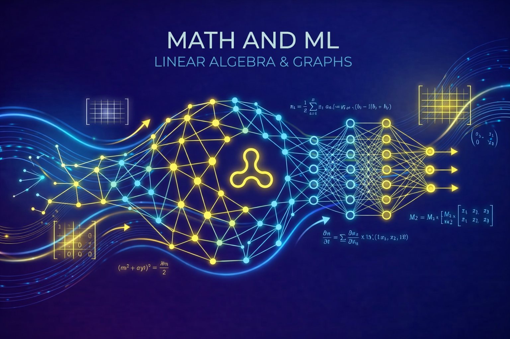

import { ResourceCard, TimeEstimate } from "@site/src/components";
import { Calculator, Layers, ClipboardCheck } from "lucide-react";

# Module 2: Linear Algebra

## <Calculator /> Goal

Understand how AI systems represent data and transform information using vectors, matrices, and geometric intuition.

This module focuses on the mathematical language used throughout machine learning: vectors for representing data, matrices for transforming features, and dot products for measuring similarity.

<TimeEstimate
  minHours={60}
  maxHours={70}
  breakdownBy={{
    "Linear Algebra": 60,
  }}
/>

## <Layers /> 1. Primary Resources

<ResourceCard
  type="course"
  title="Linear Algebra - Khan Academy"
  url="https://www.khanacademy.org/math/linear-algebra"
  duration="10-12 hours"
  difficulty="beginner"
  why="Practice-heavy track to reinforce matrix operations, transformations, and vector intuition."
/>

## Additional Resources

<ResourceCard
  type="video"
  title="Essence of Linear Algebra - 3Blue1Brown"
  url="https://www.youtube.com/playlist?list=PLZHQObOWTQDPD3MizzM2xVFitgF8hE_ab"
  duration="6-8 hours"
  difficulty="beginner"
  why="Visual intuition for vectors and matrices so transformations feel concrete, not abstract."
/>

**Why it matters:**

AI models operate on numerical representations.

- **Vectors** represent inputs such as text embeddings, image pixels, audio features, and user behavior.
- **Matrices** transform those representations through layers, projections, and feature combinations.
- **Dot products** measure alignment and similarity, which appears in retrieval, attention, recommendation, and classification systems.

Without linear algebra, AI systems remain a black box. With it, you can reason about what models store, compare, and transform.

This module connects abstract math to concrete AI behavior.

**What to expect:**

By the end of this module, learners will:

- Understand vectors as representations of data
- Interpret matrix multiplication as transformation and combination of features
- Build intuition for dot products as a measure of similarity
- Understand how high-dimensional representations appear in modern AI systems
- Connect linear algebra concepts to embeddings, neural network layers, and similarity search

After completing this module, learners will understand how AI models represent and transform information.

---

## <ClipboardCheck /> Completion Checklist

- [ ] Completed core units in **Linear Algebra - Khan Academy** (vectors, matrices, matrix multiplication, linear transformations), with a **final exam score ≥ 80%**.
- [ ] Watched **Essence of Linear Algebra - 3Blue1Brown** and wrote short notes connecting vectors, matrices, and dot products to AI systems.
