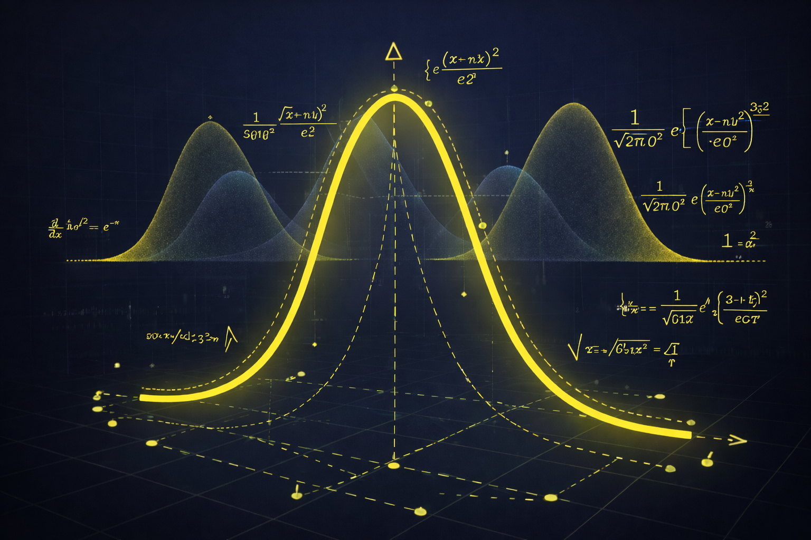

import { ResourceCard, TimeEstimate } from "@site/src/components";
import { Sigma, BarChart3, ClipboardCheck, FileText } from "lucide-react";

# Module 3: Probability & Statistics for AI

## <Sigma /> Goal

Develop intuition for how AI systems reason under uncertainty, express confidence, and update beliefs based on data.

This module introduces probability as a mental model for reasoning, not just a collection of formulas.

<TimeEstimate
  minHours={60}
  maxHours={90}
  breakdownBy={{
    Statistics: 45,
    Probability: 30,
  }}
/>

## <BarChart3 /> 1. Resources

<ResourceCard
  type="course"
  title="Statistics and Probability - Khan Academy"
  url="https://www.khanacademy.org/math/statistics-probability"
  duration="50-60 hours"
  difficulty="beginner"
  why="Builds probability intuition (distributions, Bayes, inference) so model outputs become interpretable confidence, not just numbers."
/>

**Why it matters:**

Neural networks do not produce certainties - they produce probability distributions.
Every AI prediction is a statement about likelihood, not truth.

Probability provides the missing connection between:

- Linear algebra (data as vectors)
- Real-world decision-making under uncertainty

Without probability, model outputs are just numbers with no interpretation.
This module teaches how to understand, trust, and question AI predictions.

**What to expect:**

By the end of this module, learners will:

- Understand randomness as structured variability, not chaos
- Interpret probability distributions (especially the Normal Distribution)
- Understand confidence, uncertainty, and likelihood
- Reason about predictions as degrees of belief
- Grasp Bayesian thinking as a method for updating beliefs with evidence

After completing this module, learners will be able to interpret AI predictions critically and understand what model “confidence” actually means.

---

## <ClipboardCheck /> Completion Checklist

- [ ] Completed core **Statistics** and **Probability** units in **Statistics and Probability - Khan Academy** (distributions, randomness, inference, random variables, conditional probability, Bayes' rule), with a single **final exam score ≥ 80%**.
