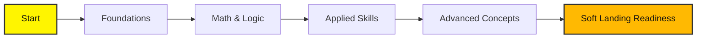

# School Program

## Goal
Build students’ absolute **fundamentals** in math, coding, software basics, problem-solving, and data handling.

## Outcome
Someone who completes School becomes a **beginner engineer ready for Soft Landing Step 0**.

## Prerequisites
* **English Fluency**: Minimum Level B2
* **Core Math Literacy**: Algebra, functions, and logical reasoning
* **Python**: [Completion of Automate the Boring Stuff with Python](https://automatetheboringstuff.com/) (until Chapter 12)

## The 6-Month Journey

:::info Ready to Start?
Ensure you have your development environment set up before diving into the foundations.
:::
