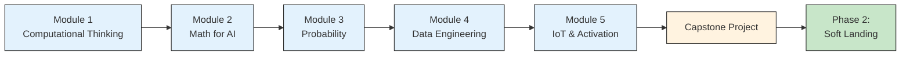

import Tabs from '@theme/Tabs';
import TabItem from '@theme/TabItem';
import ProgressIndicator from '@site/src/components/ProgressIndicator';
import TimeEstimate from '@site/src/components/TimeEstimate';

# Phase 1: School Program
## Building Your Engineering Foundation

<ProgressIndicator phase={1} totalPhases={3} />

---

## 🎯 What You're Building Here

Welcome to the starting line of your AI engineering journey. If you're here, you likely fall into one of these categories:

✅ **Complete beginner** – You've never written code before  
✅ **Self-taught coder** – You know some Python but have gaps in fundamentals  
✅ **Career changer** – Coming from a non-technical background  
✅ **CS student** – Want to transition specifically into AI engineering

**No matter where you're starting from, this phase will give you the bedrock skills that every professional AI engineer needs.**

---

## 🔍 The Hard Truth About Foundations

<div className="reality-check" style={{ padding: '1.5rem', borderLeft: '4px solid var(--ifm-color-danger)', backgroundColor: 'var(--ifm-background-surface-color)', marginBottom: '2rem' }}>

### Why Most People Skip This (And Regret It Later)

I get it. You want to jump straight to training neural networks. You see job postings asking for "PyTorch, TensorFlow, LLMs" and think: *"Why am I learning command line basics?"*

**Here's what happens if you skip foundations:**

**Month 3:** Your model training fails. The error message says "CUDA out of memory."  
You have no idea what that means or how to debug it.

**Month 6:** You need to preprocess 10GB of text data.  
Your Python script crashes. You don't know how to profile memory or optimize loops.

**Month 9:** You're in a technical interview. They ask you to explain backpropagation.  
You've used PyTorch's `.backward()` but can't explain what's mathematically happening.

**The result?** You become a "prompt engineer" who can use AI tools but can't build or debug them. That's not the engineer companies pay $150K+ to hire.

</div>

:::tip 💡 The Compounding Effect of Foundations

**Every hour invested in Phase 1 saves you 10 hours of frustration in Phase 2.**

Think of it like building a house. You can't start with the walls if the foundation is cracked. These fundamentals aren't "boring basics" – they're the difference between:
- **Copying code from Stack Overflow** vs. **Understanding how to fix it**
- **Following tutorials blindly** vs. **Building systems from scratch**  
- **Getting stuck for days** vs. **Debugging in minutes**

Senior engineers aren't "smarter" – they just have rock-solid fundamentals.

:::

---

## 📚 What You'll Master in Phase 1

<Tabs>
<TabItem value="overview" label="Overview" default>

### The 5 Pillars of Engineering Fundamentals

<div className="pillars-grid">

**1. Computational Thinking** ⚙️  
**Time:** 30-40 hours  
Master the terminal, Git, and algorithmic problem-solving.  
*You'll think like a computer, not just use one.*

**2. Mathematics for AI** 📐  
**Time:** 50-60 hours  
Calculus, linear algebra, and probability – the language of AI.  
*You'll understand WHY models work, not just HOW to use them.*

**3. Probability & Statistics** 📊  
**Time:** 30-40 hours  
Data distributions, hypothesis testing, Bayesian thinking.  
*You'll interpret model outputs and evaluation metrics correctly.*

**4. Python Data Engineering** 🐍  
**Time:** 40-50 hours  
Pandas, data cleaning, visualization, and software tools.  
*You'll wrangle messy real-world data like a pro.*

**5. IoT & Activation** 🚀  
**Time:** 20-30 hours  
Deploy simple ML models to real devices (edge computing).  
*You'll see your code running in the physical world.*

</div>

**Total Time Investment:** 170-220 hours  
**Expected Duration:**  
- Full-time (40h/week): 6-8 weeks  
- Part-time (20h/week): 12-16 weeks  
- Casual (10h/week): 20-24 weeks

</TabItem>

<TabItem value="skills" label="Skills You'll Gain">

### By the End of School Program, You Will:

**🖥️ Terminal & Developer Tools**
- [ ] Navigate any Linux/Mac system using only command line
- [ ] Write shell scripts to automate repetitive tasks
- [ ] Use Vim for quick file editing on remote servers
- [ ] Set up VS Code with optimal extensions and workflows
- [ ] Debug errors using stack traces and logs

**🔧 Version Control (Git)**
- [ ] Create repositories and manage branches
- [ ] Write meaningful commit messages
- [ ] Resolve merge conflicts confidently  
- [ ] Collaborate on projects using GitHub
- [ ] Understand `.gitignore`, `.env`, and best practices

**🧮 Mathematical Foundations**
- [ ] Interpret derivatives as rates of change (why gradients matter)
- [ ] Visualize vectors and matrices as transformations
- [ ] Compute dot products and understand their meaning
- [ ] Explain probability distributions and sampling
- [ ] Calculate expected values and variance

**💻 Algorithmic Problem-Solving**
- [ ] Solve 50+ LeetCode Easy problems
- [ ] Recognize common patterns (two pointers, sliding window, etc.)
- [ ] Analyze time and space complexity (Big O notation)
- [ ] Write pseudocode before coding
- [ ] Debug systematic errors efficiently

**🐍 Python Data Skills**
- [ ] Load and clean CSV/JSON datasets with Pandas
- [ ] Handle missing values and outliers
- [ ] Create visualizations with Matplotlib/Seaborn
- [ ] Write modular, reusable functions
- [ ] Use list comprehensions and lambda functions naturally

**🚀 Deployment Basics**
- [ ] Train a simple ML model (using Teachable Machine or Scikit-learn)
- [ ] Deploy to a Raspberry Pi or Arduino
- [ ] Understand edge computing vs. cloud computing
- [ ] Debug hardware-software integration issues

</TabItem>

<TabItem value="projects" label="Portfolio Projects">

### What You'll Build

By the end of Phase 1, you'll have these projects in your portfolio:

**Project 1: Data Analysis Pipeline** 📊  
- Load a public dataset (e.g., Titanic, housing prices)
- Clean and preprocess the data
- Generate statistical insights
- Create visualizations
- Export results to CSV/HTML report

**Project 2: Algorithm Visualizer** 🎨  
- Implement 5 sorting algorithms (bubble, merge, quick, etc.)
- Visualize each step-by-step
- Compare performance with different input sizes
- Write unit tests

**Project 3: Git Collaboration Exercise** 🤝  
- Fork an open-source project
- Fix a bug or add a small feature
- Submit a pull request
- Respond to code review feedback

**Project 4: IoT ML Demo** 🤖  
- Train an image classifier (cats vs. dogs, or hand gestures)
- Deploy to Raspberry Pi or Arduino
- Create a physical interface (LED indicator, sound, etc.)
- Document the entire process

**Capstone: Personal Data Dashboard** 📈  
- Choose a dataset you care about (fitness, finance, habits, etc.)
- Build a data pipeline to clean and process it
- Create an interactive dashboard with insights
- Automate daily/weekly updates
- Deploy online (GitHub Pages or Heroku)

</TabItem>
</Tabs>

---

## 🛣️ Your Learning Path

<div className="learning-roadmap">



**Important:** You must complete modules sequentially. Each builds on the previous one.

</div>

---

## ⏱️ Time Commitment & Expectations

<TimeEstimate
  minHours={170}
  maxHours={220}
  breakdownBy={{
    'Video Lectures & Reading': 50,
    'Hands-On Exercises': 80,
    'Practice Problems (LeetCode, etc.)': 40,
    'Portfolio Projects': 35,
    'Review & Debugging': 15
  }}
/>

### Weekly Schedule Recommendations

**Full-Time Track (40-50 hours/week):**
```
Monday-Friday:
- Morning (3h): Video lectures + note-taking
- Afternoon (3h): Hands-on coding exercises
- Evening (2h): LeetCode practice or project work

Weekend:
- Saturday: Project building (4-6h)
- Sunday: Review + planning next week (2-3h)
```

**Part-Time Track (20-25 hours/week):**
```
Weekdays (M-F):
- Early morning or evening: 2-3 hours daily
- Focus on one module per week

Weekends:
- Saturday: Deep work on projects (6-8h)
- Sunday: Review + community engagement (2-3h)
```

---

## 🎓 Entrance Requirements

<div className="requirements-section">

### Who Can Start School Program?

**Minimum Prerequisites:**
- ✅ **Age:** 18+ (or parental consent if under 18)
- ✅ **Education:** High school diploma or equivalent
- ✅ **Math:** Comfortable with algebra (variables, equations, functions)
- ✅ **English:** Reading comprehension (all materials in English)
- ✅ **Computer:** Access to a laptop/desktop with internet

**Technical Prerequisites:**
- ❌ **NO** prior programming experience required
- ❌ **NO** math beyond high school algebra
- ❌ **NO** CS degree needed

**Personal Prerequisites (Most Important):**
- ✅ **Growth mindset** – Willing to struggle and learn from mistakes
- ✅ **Discipline** – Can commit 10-40 hours/week consistently
- ✅ **Curiosity** – Want to understand HOW things work, not just use them
- ✅ **Persistence** – Won't give up when things get hard

</div>

:::caution ⚠️ Self-Assessment: Are You Ready?

**Ask yourself honestly:**

1. Can I commit **at least 10 hours per week** for the next 3-6 months?
2. Am I willing to **struggle through confusion** before breakthroughs happen?
3. Can I **seek help when stuck** (Discord, forums, documentation)?
4. Am I prepared for this to **feel hard** initially?

If you answered "No" to any of these, **that's okay** – but you should reconsider your timeline or commitment level. Half-hearted effort leads to half-baked skills.

**If you answered "Yes" to all four:** Welcome aboard. You're ready.

:::

---

## 🚀 Ready to Begin?

<div className="cta-container">

<a href="/docs/school/module-1-computational-thinking" className="button button--primary button--lg">
  Begin Module 1 →
</a>

</div>
