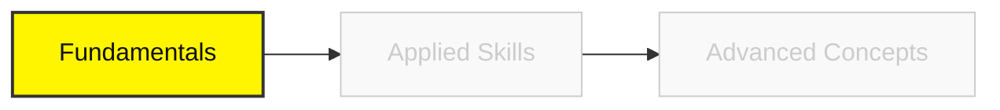

# Phase 1 & 2: Fundamentals

## 🧱 Phase 1: Computational Thinking
*Learn to speak the language of computers.*

### 💻 Module 1: The Developer's Environment 
**Goal**: Get comfortable in the terminal and IDE.

#### 1. Setup & Command Line
*   **Resources**: 
    *   **[VS Code Setup Guide](https://code.visualstudio.com/docs/setup/setup-overview)**
    *   **[Linux Journey (Command Line)](https://linuxjourney.com/)**
        *   **Why it's important**: The GUI (mouse) is slow. The Command Line is how engineers talk to servers.
        *   **What to expect**: You will navigate files, search text (`grep`), and manage permissions without touching a mouse.

#### 2. Algorithmic Logic
*   **Resources**:
    *   **[HackerRank: Problem Solving (Basic)](https://www.hackerrank.com/skills-directory/problem_solving_basic)**
        *   **Why it's important**: You need to train your brain to break big problems into tiny steps.
        *   **What to expect**: You will solve puzzles using loops, arrays, and logic until it becomes second nature.

---

## 📐 Phase 2: Mathematics for AI 
*Math is not about calculation; it's about understanding change.*

### 📈 Module 2: Calculus & Linear Algebra
**Goal**: Understand the engine of Neural Networks.

#### 1. The Mathematics of "Learning" (Calculus)
*   **Resources**:
    *   **[3Blue1Brown: Essence of Calculus](https://www.youtube.com/playlist?list=PLZHQObOWTQDMsr9K-rj53DwVRMYO3t5Yr)**
        *   **Why it's important**: "Learning" in AI is just minimizing error. Calculus (Derivatives) tells us *which direction* to step to reduce error.
        *   **What to expect**: You will visualize "slope" and "gradients" not as equations, but as arrows pointing downhill.

#### 2. The Mathematics of "Data" (Linear Algebra)
*   **Resources**:
    *   **[3Blue1Brown: Essence of Linear Algebra](https://www.youtube.com/playlist?list=PLZHQObOWTQDPD3MizzM2xVFitgF8hE_ab)**
        *   **Why it's important**: Images, text, and sound are all just lists of numbers (Vectors). You need to maneuver them.
        *   **What to expect**: You will understand Dot Products as a measure of "similarity" between two things.

### 🎲 Module 3: Probability
**Goal**: Quantify uncertainty.

*   **Resources**:
    *   **[Khan Academy: Statistics](https://www.khanacademy.org/math/statistics-probability)**
        *   **Why it's important**: AI is never 100% sure. It says "I am 90% confident". You need to understand what that means.
        *   **What to expect**: You will master the Bell Curve (Normal Distribution) and Bayes' Theorem.

---

### [Next: Applied Engineering ->](./03-applied-skills.mdx)
