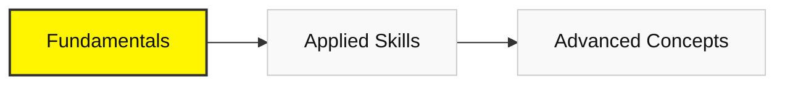

# Phase 1 & 2: Fundamentals

## 🧱 Phase 1: Computational Thinking
*Learn to speak the language of computers.*

### 💻 Module 1: The Developer's Environment 
**Goal**: Get comfortable in the terminal and IDE.

#### 1. Setup & Command Line
*   **Resources**: 
    *   **[VS Code Setup Guide](https://code.visualstudio.com/docs/setup/setup-overview)**
    *   **[Linux Journey (Command Line)](https://linuxjourney.com/)**
        *   **Why it's important**: The GUI (mouse) is slow. The Command Line is how engineers talk to servers.
        *   **What to expect**: You will navigate files, search text (`grep`), and manage permissions without touching a mouse.

#### 2. Algorithmic Logic
*   **Resources**:
    *   **[HackerRank: Problem Solving (Basic)](https://www.hackerrank.com/skills-directory/problem_solving_basic)**
        *   **Why it's important**: You need to train your brain to break big problems into tiny steps.
        *   **What to expect**: You will solve puzzles using loops, arrays, and logic until it becomes second nature.

---

## 📐 Phase 2: Mathematics for AI 
*Math is not about calculation; it's about understanding change.*

### 📈 Module 2: Calculus & Linear Algebra for AI

#### **Goal**
Understand the mathematical foundations behind how AI models learn from data and represent information.

This module explains the core mechanics of neural networks: how they adjust themselves (calculus) and how they store and transform data (linear algebra).

#### **Resources**

##### **Primary Resources**

*   **[Calculus 1 - Khan Academy](https://www.khanacademy.org/math/calculus-1)**
    *   Provides a structured, step-by-step foundation in derivatives and rates of change, giving learners the formal tools needed to understand optimization and learning in AI.
*   **[Essence of Linear Algebra - 3Blue1Brown](https://www.youtube.com/playlist?list=PLZHQObOWTQDPD3MizzM2xVFitgF8hE_ab)**
    *   Builds deep visual intuition for vectors, matrices, and transformations, helping learners understand how data is represented and manipulated inside models.

##### **Additional Resource**

*   **[Essence of Calculus - 3Blue1Brown](https://www.youtube.com/playlist?list=PLZHQObOWTQDMsr9K-rj53DwVRMYO3t5Yr)**
    *   Reinforces intuition by visualizing derivatives, slopes, and gradients, helping learners see learning as movement through an error landscape rather than symbolic manipulation.
*   **[Linear Algebra - Khan Academy](https://www.khanacademy.org/math/linear-algebra)**
    *   Provides structured practice and formal grounding in vector operations and matrix multiplication, reinforcing the mathematical mechanics behind data transformations used in AI models.

#### **Why it matters**

At its core, AI learning is optimization.

*   **Calculus** explains how models improve:
    *   Learning is the process of adjusting parameters to reduce error, guided by derivatives and gradients.
*   **Linear algebra** explains what models operate on:
    *   Images, text, and sound are all represented as vectors and transformed through matrix operations.

Together, these two fields form the mathematical engine of neural networks.
Without them, AI training becomes a black box rather than an understandable process.

This module connects abstract math to concrete AI behavior.

#### **What to expect**

By the end of this module, learners will:

*   Understand derivatives as measures of change and direction
*   Interpret gradients as signals telling a model how to improve
*   See learning as moving “downhill” on an error surface
*   Understand vectors as representations of data
*   Interpret matrix multiplication as transformation and combination of features
*   Build intuition for dot products as a measure of similarity

After completing this module, learners will understand how and why AI models learn, not just that they do.

### 🎲 Module 3: Probability & Statistics for AI

#### **Goal**
Develop intuition for how AI systems reason under uncertainty, express confidence, and update beliefs based on data.

This module introduces probability as a mental model for reasoning, not just a collection of formulas.

#### **Resources**

*   **[Statistics and Probability - Khan Academy](https://www.khanacademy.org/math/statistics-probability)**
    *   This course builds foundational intuition through visual explanations and real-world examples, allowing learners to focus on understanding uncertainty, distributions, and confidence rather than mechanical computation. It provides the statistical grounding needed to interpret probabilistic outputs in AI systems.

#### **Why it matters**

Neural networks do not produce certainties - they produce probability distributions.
Every AI prediction is a statement about likelihood, not truth.

Probability provides the missing connection between:

*   Linear algebra (data as vectors)
*   Calculus (learning through optimization)
*   Real-world decision-making under uncertainty

Without probability, model outputs are just numbers with no interpretation.
This module teaches how to understand, trust, and question AI predictions.

#### **What to expect**

By the end of this module, learners will:

*   Understand randomness as structured variability, not chaos
*   Interpret probability distributions (especially the Normal Distribution)
*   Understand confidence, uncertainty, and likelihood
*   Reason about predictions as degrees of belief
*   Grasp Bayesian thinking as a method for updating beliefs with evidence

After completing this module, learners will be able to interpret AI predictions critically and understand what model “confidence” actually means.

---

### [Next: Applied Engineering ->](./03-applied-skills.mdx)
