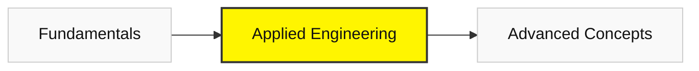

# Phase 3: Applied Engineering (Part 1)

*Stop learning, start building.*

### 🐍 Module 4: Python Data Engineering
**Goal**: Manipulate real-world data.

#### 1. Pandas & Data Cleaning
*   **Resources**:
    *   **[Kaggle: Pandas Micro-Course](https://www.kaggle.com/learn/pandas)**
        *   **Why it's important**: 80% of an AI project is cleaning messy CSV files.
        *   **What to expect**: You will load thousands of rows of data, filter them, and fix missing values with a single line of code.

#### 2. Software Engineering Tools
*   **Resources**:
    *   **[Git Branching Game](https://learngitbranching.js.org/)**
        *   **Why it's important**: You need to save your work and collaborate without overwriting each other's code.
        *   **What to expect**: You will master `git commit`, `git push`, and `git merge`.

---

### [Next: Advanced Concepts ->](./04-advanced-concepts.mdx)
