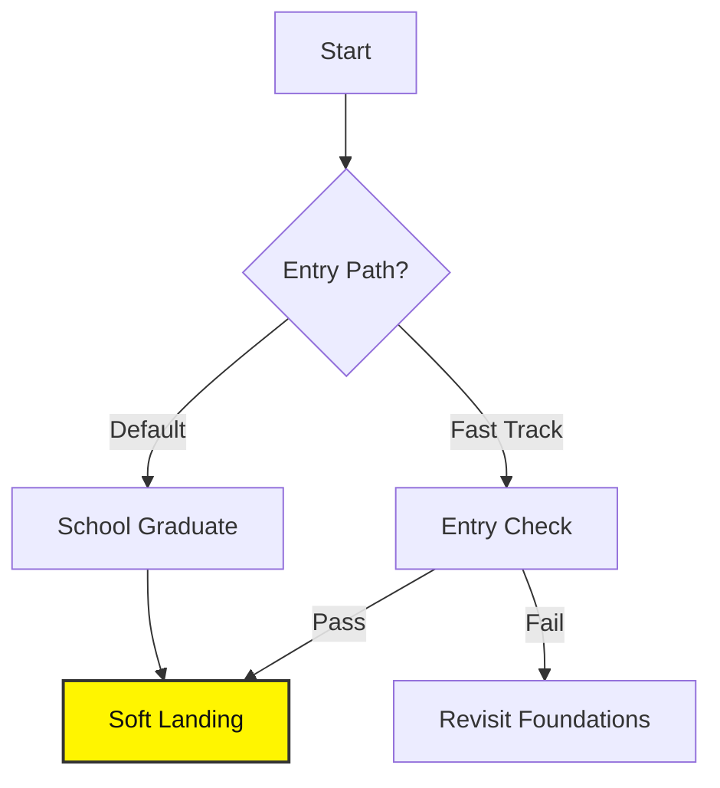

# Softlanding Program

## Goal
Transform students with basic coding and math foundations into **technically capable junior engineers** with strong AI fundamentals, solid software engineering skills, and **field-specific technical depth**.

## Outcomes
* Deep understanding of ML/DL concepts.
* Practical engineering skills (APIs, Docker, Testing).
* Ability to implement models from scratch.
* Readiness for specialization.

## Prerequisites

:::warning Entry Paths
There are two main ways to enter the Soft Landing program.
:::

### 1. School Completion (Default)
* Completed **HumblebeeAI Academy – School** (6 months).

### 2. Equivalent Readiness (Fast Track)
* Must pass the **Soft Landing Entry Check**.
* **Requirements**:
    * **English**: B2 Level.
    * **Python**: Automate the Boring Stuff (Ch 12), Debugging skills.
    * **Problem Solving**: HackerRank Basic, 20 LeetCode Easy.
    * **Math**: Calculus, Linear Algebra, Stats intuition.
    * **Tools**: Git, CLI, Pandas.
